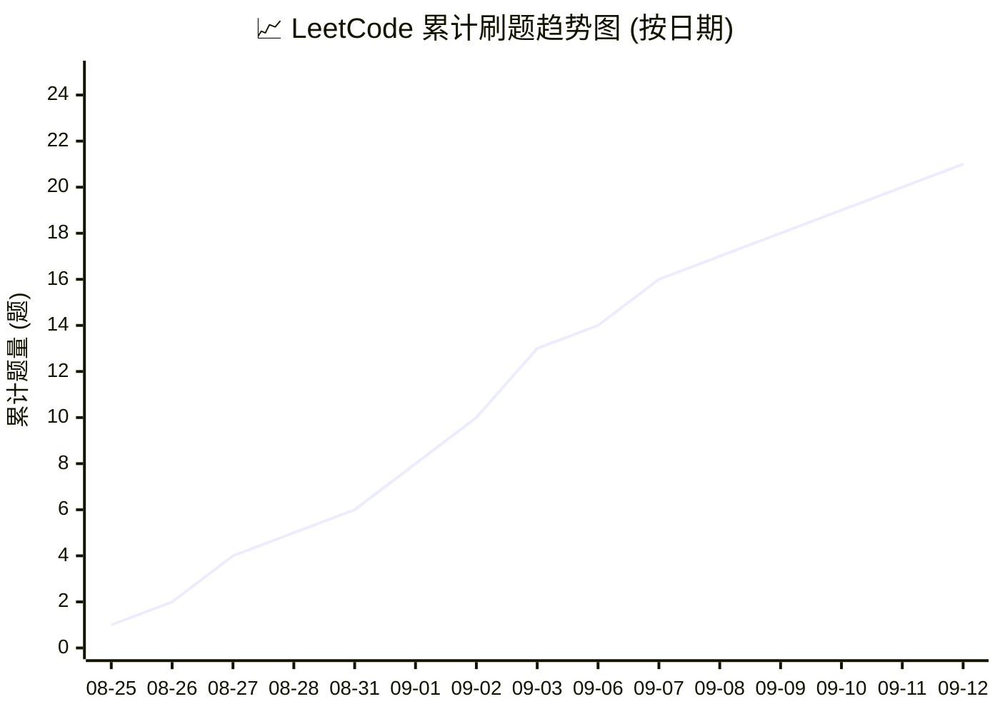

# 💡 LeetCode-Journey

> 记录个人 LeetCode 刷题历程与算法沉淀。保持思考，持续精进！

[](https://www.python.org/)
[](https://leetcode.cn/)
[](https://leetcode.cn/)
[](https://leetcode.cn/)
[](https://leetcode.cn/)
[](https://leetcode.cn/)

---

## 📊 刷题进度与频率趋势



---

## 📚 刷题索引

| 题号 | 题目名称 | 难度 | 核心解法 / 算法标签 | 时间复杂度 | 空间复杂度 | 题解代码 |
| :---: | :--- | :---: | :--- | :---: | :---: | :---: |
| 0001 | [两数之和](https://leetcode.cn/problems/two-sum/) | 🟢 简单 | 哈希表 (Hash Map) | $\mathcal{O}(n)$ | $\mathcal{O}(n)$ | [1.two-sum.py](./1.two-sum.py) |
| 0002 | [两数相加](https://leetcode.cn/problems/add-two-numbers/) | 🟡 中等 | 模拟 / 链表 / 剪枝 | $\mathcal{O}(\max(m, n))$ | $\mathcal{O}(\max(m, n))$ | [2.add-two-numbers.py](./2.add-two-numbers.py) |
| 0003 | [无重复字符的最长子串](https://leetcode.cn/problems/longest-substring-without-repeating-characters/) | 🟡 中等 | 滑动窗口 / 哈希表 / 双指针 | $\mathcal{O}(n)$ | $\mathcal{O}(\vert\Sigma\vert)$ | [3.longest-substring-without-repeating-characters.py](./3.longest-substring-without-repeating-characters.py) |
| 0004 | [寻找两个正序数组的中位数](https://leetcode.cn/problems/median-of-two-sorted-arrays/) | 🔴 困难 | 二分查找 / 寻找第 k 小元素 / 双指针 | $\mathcal{O}(\log(m + n))$ | $\mathcal{O}(1)$ | [4.median-of-two-sorted-arrays.py](./4.median-of-two-sorted-arrays.py) |
| 0005 | [最长回文子串](https://leetcode.cn/problems/longest-palindromic-substring/) | 🟡 中等 | 中心扩散法 / 动态规划 / 双指针 | $\mathcal{O}(n^2)$ | $\mathcal{O}(1)$ | [5.longest-palindromic-substring.py](./5.longest-palindromic-substring.py) |
| 0011 | [盛最多水的容器](https://leetcode.cn/problems/container-with-most-water/) | 🟡 中等 | 对向双指针 / 贪心 | $\mathcal{O}(n)$ | $\mathcal{O}(1)$ | [11.container-with-most-water.py](./11.container-with-most-water.py) |
| 0015 | [三数之和](https://leetcode.cn/problems/3sum/) | 🟡 中等 | 排序 / 对向双指针 / 哈希分类 | $\mathcal{O}(n^2)$ | $\mathcal{O}(1)$ | [15.3-sum.py](./15.3-sum.py) |
| 0017 | [电话号码的字母组合](https://leetcode.cn/problems/letter-combinations-of-a-phone-number/) | 🟡 中等 | 回溯 (DFS) / 广度优先搜索 (BFS) | $\mathcal{O}(3^m \times 4^n)$ | $\mathcal{O}(3^m \times 4^n)$ | [17.letter-combinations-of-a-phone-number.py](./17.letter-combinations-of-a-phone-number.py) |
| 0019 | [删除链表的倒数第 N 个结点](https://leetcode.cn/problems/remove-nth-node-from-end-of-list/) | 🟡 中等 | 快慢双指针 / 虚拟头节点 (Dummy) / 链表 | $\mathcal{O}(L)$ | $\mathcal{O}(1)$ | [19.remove-nth-node-from-end-of-list.py](./19.remove-nth-node-from-end-of-list.py) |
| 0020 | [有效的括号](https://leetcode.cn/problems/valid-parentheses/) | 🟢 简单 | 栈 (Stack) / 哈希表 | $\mathcal{O}(n)$ | $\mathcal{O}(n)$ | [20.valid-parentheses.py](./20.valid-parentheses.py) |
| 0021 | [合并两个有序链表](https://leetcode.cn/problems/merge-two-sorted-lists/) | 🟢 简单 | 双指针 / 链表 / 迭代 | $\mathcal{O}(m + n)$ | $\mathcal{O}(1)$ | [21.merge-two-sorted-lists.py](./21.merge-two-sorted-lists.py) |
| 0022 | [括号生成](https://leetcode.cn/problems/generate-parentheses/) | 🟡 中等 | 回溯 (DFS) / 剪枝 / 动态规划 | $\mathcal{O}(\frac{4^n}{\sqrt{n}})$ | $\mathcal{O}(n)$ | [22.generate-parentheses.py](./22.generate-parentheses.py) |
| 0042 | [接雨水](https://leetcode.cn/problems/trapping-rain-water/) | 🔴 困难 | 单调栈 / 双向扫描 / 双指针 | $\mathcal{O}(n)$ | $\mathcal{O}(n)$ | [42.trapping-rain-water.py](./42.trapping-rain-water.py) |
| 0046 | [全排列](https://leetcode.cn/problems/permutations/) | 🟡 中等 | 回溯 (DFS) / 集合差集 / 原地交换 | $\mathcal{O}(n \times n!)$ | $\mathcal{O}(n)$ | [46.permutations.py](./46.permutations.py) |
| 0053 | [最大子数组和](https://leetcode.cn/problems/maximum-subarray/) | 🟡 中等 | 动态规划 / 贪心 (Kadane) / 分治 | $\mathcal{O}(n)$ | $\mathcal{O}(1)$ | [53.maximum-subarray.py](./53.maximum-subarray.py) |
| 0146 | [LRU 缓存](https://leetcode.cn/problems/lru-cache/) | 🟡 中等 | 设计 / 哈希表 / 双向链表 | $\mathcal{O}(1)$ | $\mathcal{O}(\text{capacity})$ | [146.lru-cache.py](./146.lru-cache.py) |
| 0200 | [岛屿数量](https://leetcode.cn/problems/number-of-islands/) | 🟡 中等 | 深度优先搜索 (DFS) / 广度优先搜索 (BFS) / 并查集 | $\mathcal{O}(M \times N)$ | $\mathcal{O}(M \times N)$ | [200.number-of-islands.py](./200.number-of-islands.py) |
| 0206 | [反转链表](https://leetcode.cn/problems/reverse-linked-list/) | 🟢 简单 | 递归 / 双指针 / 链表 | $\mathcal{O}(n)$ | $\mathcal{O}(1)$ | [206.reverse-linked-list.py](./206.reverse-linked-list.py) |
| 0226 | [翻转二叉树](https://leetcode.cn/problems/invert-binary-tree/) | 🟢 简单 | 二叉树 / 深度优先搜索 (DFS) / 广度优先搜索 (BFS) | $\mathcal{O}(n)$ | $\mathcal{O}(n)$ | [226.invert-binary-tree.py](./226.invert-binary-tree.py) |
| 0234 | [回文链表](https://leetcode.cn/problems/palindrome-linked-list/) | 🟢 简单 | 快慢指针 / 反转链表 / 双指针 | $\mathcal{O}(n)$ | $\mathcal{O}(1)$ | [234.palindrome-linked-list.py](./234.palindrome-linked-list.py) |
| 0236 | [二叉树的最近公共祖先](https://leetcode.cn/problems/lowest-common-ancestor-of-a-binary-tree/) | 🟡 中等 | 二叉树 / 后序遍历 / 递归 / 深度优先搜索 (DFS) | $\mathcal{O}(n)$ | $\mathcal{O}(n)$ | [236.lowest-common-ancestor-of-a-binary-tree.py](./236.lowest-common-ancestor-of-a-binary-tree.py) |

---

## 📂 目录结构

```text
LeetCode-Journey/
├── 1.two-sum.py       # [题号].[题目英文名].py
├── README.md          # 刷题索引与记录
└── ...
```

---

## 📈 算法分类速查

- **基础**：数组、哈希表、双指针、滑动窗口、二分查找
- **进阶**：链表、栈与队列、二叉树、回溯、贪心
- **高阶**：动态规划、图论、并查集、单调栈